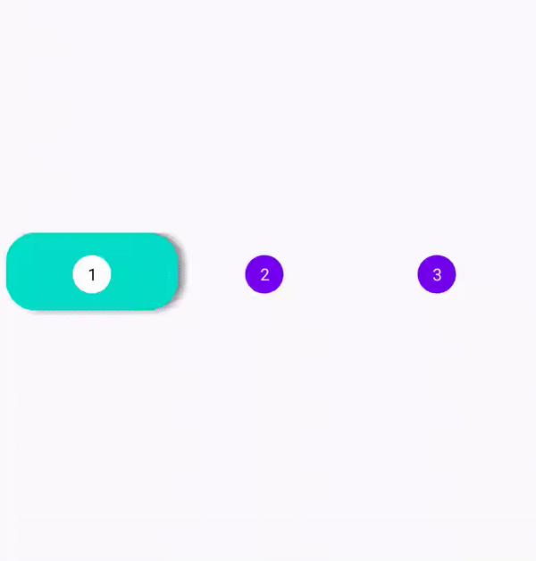
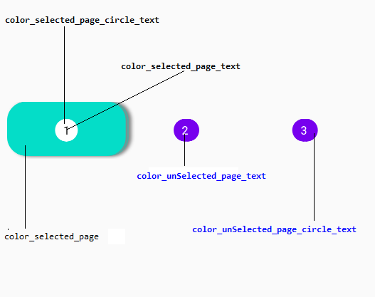

[](https://www.android.com)
 [](https://jitpack.io/#Saif-al-islam/PageOrderIndicator-Android)
 []()


**PageOrderIndicator** - An Android library that can be used as indicator for Multiple Pages. 

## Sample


## Usage

### step 1

Include the library as a local library project or add the dependency in your build.gradle.

```groovy
dependencies {
	   implementation 'com.github.Saif-al-islam:PageOrderIndicator-Android:0.1.0'
	}
```

Add it in your root build.gradle.

```groovy
allprojects {
		repositories {
			maven { url 'https://jitpack.io' }
		}
	}
```

### Step 2

Include the SliderCounterView in your layout. And you can customize it like this.

```xml
    <com.saif.pageorderindicator.PageOrderIndicatorView
            android:layout_width="match_parent"
            android:layout_height="wrap_content"
            app:color_selected_page="#04DDC8"
            app:color_selected_page_circle_text="#FFFFFF"
            app:color_selected_page_text="#000000"
            app:color_unSelected_page_circle_text="#7700EE"
            app:color_unSelected_page_text="#FFFFFF"
            app:corner_radius_page="22dp"
            app:circle_radius_text="1dp"
            app:page_elevation="4dp"
            app:isPageClickable="true"
            app:circle_text_padding="5dp"
            app:page_count="3" />
```

## XML Attributes Description

|name|format|description|
|:---:|:---:|:---:|
| corner_radius_page | dimension | The radius of corner for every indicator that is finished , default is 0
| circle_radius_text | dimension | The radius of corner for every circle of the number page.
| circle_text_padding | dimension | Padding of the number page, default is 0.
| isPageClickable | boolean | TRUE if you want to make user can select the page else FALSE, default is true.
| page_elevation | dimension | the elevation of every page indicator that is finished, default is 4.
| init_page | integer | Start Page , default is 0
| page_count | integer | Total pages, default is 1
| color_unSelected_page_circle_text | color | Explained in the below image, default is BLACK.
| color_unSelected_page_text | color | Explained in the below image, default is WHITE.
| color_selected_page_text | color | Explained in the below image, default is BLACK.
| color_selected_page | color | Explained in the below image, default is BLACK.





## Code Attribute Description

All the attribute of the xml can be changed throw the Java/Kotlin code in addition to:

|name|parameters|description| Return |
|:---:|:---:|:---:|:---:|
|onPageChanged | Int position: current Page | This Function is called every time the current page changes. | Nothing.
|onPageClicked | Int position: current Page | This Function is called every time a page click . | Boolean: True if you want to go to that page else false. 


## UI/UX by:
Mohamed Elzohairy

